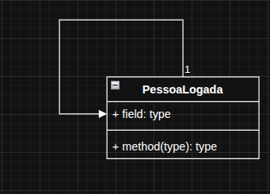

# Singleton

O Singleton é um padrão de projeto que garante que só exista uma única instância de uma classe durante toda a execução do programa.

No exemplo usado mostra o funcionamento de um sistema, onde apenas uma pessoa logada é instanciada, com base em nome e cpf.

